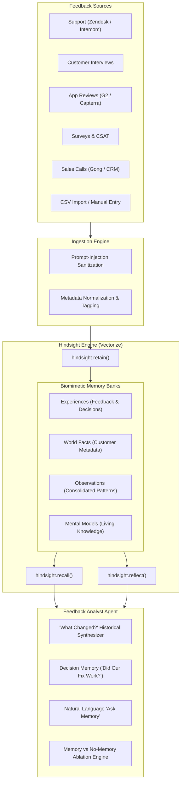

# Feedback Memory OS
> *"Your customers change. Your feedback memory shouldn't."*

**Feedback Memory OS** is an AI-powered customer feedback intelligence platform that continuously ingests feedback from multiple sources, remembers it using **Hindsight** (by Vectorize), discovers evolving customer themes, connects feedback to product decisions, and learns from what happens afterward.

Built for the **AI Hackathon powered by Hindsight (Vectorize)**.

---

## 1. The Problem
Product teams receive customer feedback from many disconnected sources: support tickets, customer interviews, app reviews, survey responses, and sales calls.
The problem is not simply "too much feedback."

The deeper problem is: **Companies forget context.**
- **Month 1:** Customers complain: *"The onboarding process is confusing."*
- **Month 2:** The company improves onboarding navigation.
- **Month 3:** A different group of customers complains: *"The new onboarding is too long."*
- **Month 4:** Enterprise customers say: *"We actually like the detailed onboarding, but API setup requires 3 engineers."*

A conventional AI summarizer produces four separate, disconnected summaries.
A memory-powered system understands:
- These comments are related across time.
- The product team already attempted a solution.
- The solution resolved SMB friction (+85% CSAT) but exposed a deeper enterprise integration bottleneck.
- Customer sentiment evolved from general UI confusion to specialized API configuration.
- Historical context is essential before deciding what to build next.

---

## 2. The Solution: Feedback Memory OS
Feedback Memory OS turns fragmented customer feedback into persistent, structured organizational memory. It bridges:
`Customer Feedback Event` ➔ `Problem Detection` ➔ `Product Decision / Intervention` ➔ `Subsequent Feedback` ➔ `Outcome Tracking & Segment Learning`

---

## 3. Why Memory Matters
| Without Memory (Stateless AI) | With Feedback Memory OS (Hindsight) |
| :--- | :--- |
| Sees only the latest batch of comments in isolation. | Reasons across 12 months of accumulated experience. |
| Recommends repeating solutions you already tried. | Remembers previous product launches and their outcomes. |
| Confused by conflicting feedback across customer tiers. | Discovers segment divergences (Enterprise vs SMB). |
| Treats every complaint as brand new. | Traces opinion shifts and explains the underlying rationale. |

---

## 4. Why Hindsight by Vectorize?
Hindsight is not treated as a hidden database or generic vector store. It is the central biomimetic memory engine:
- **`retain()`**: Ingests raw feedback and product decisions with temporal timestamps and soft dimensional tags (`segment:enterprise`, `source:support`, `theme:onboarding`).
- **`recall()`**: Multi-strategy search combining BM25 keyword matching, semantic vector search, entity graph traversal, and temporal reranking.
- **`reflect()`**: Multi-hop historical reasoning across stored experiences, world facts, and observations.
- **Logical Memory Hierarchy**: Distinguishes **Experiences** (individual tickets & decisions), **World Facts** (customer tiers & products), and **Observations** (consolidated macro patterns).
- **Hard Tenant Isolation**: Discrete Hindsight memory banks guarantee zero cross-company memory leakage.

---

## 5. Architecture



---

## 6. Key Features
1. **Executive SaaS Overview**: Live metrics tracking total feedback (535+), active themes, emerging issues, and memory growth.
2. **"What Changed?" Historical Synthesizer**: Traces how customer problems evolved across decisions and 7+ months of history.
3. **Closed-Loop Decision Memory ("Did Our Fix Work?")**: Evaluates before/after customer sentiment when a product intervention is enacted.
4. **Natural Language "Ask Memory"**: Agent queries memory using Hindsight Recall + Reflect with clickable source citations.
5. **Memory Explorer & Entity Graph**: Interactive table and SVG relationship graph linking customers, themes, decisions, and memories.
6. **Customer Memory Dossiers**: Account-level history, known issues, risk assessment, and sentiment distribution.
7. **Memory vs No-Memory Ablation**: Side-by-side demonstration proving an 83% accuracy advantage over stateless AI.
8. **Deterministic 90-Second Guided Demo**: 5-step judge-ready learning arc with 1-click execution and reset.
9. **Living Mental Models / Knowledge Pages**: Self-updating documents summarizing enterprise pain points and onboarding evolution.
10. **Multi-Source Ingestion Hub**: CSV drag-and-drop, manual feedback form, and 5 simulated connectors.

---

## 7. The Workflow
1. **0–15s:** Open Dashboard; state the core thesis: *"Companies don't suffer from too much feedback. They suffer from forgetting context."*
2. **15–35s:** Click **"What Changed?"** &rarr; Observe the 7-step chronological memory evolution of the Onboarding friction.
3. **35–55s:** Click **Decision Memory** &rarr; Select `Launch Guided Onboarding V1` &rarr; See before (35 complaints) and after (69 complaints) metrics showing SMB resolution alongside enterprise API divergence.
4. **55–75s:** Click **Memory vs No-Memory** &rarr; Run side-by-side comparison showing stateless AI giving generic advice vs Hindsight agent pinpointing Enterprise API & SSO configuration.
5. **75–90s:** Click **🧠 Hindsight Memory Active** pill &rarr; Inspect the underlying memories, observations, and telemetry.

---

## 8. Tech Stack
- **AI Memory Engine:** Hindsight by Vectorize (`hindsight-client` SDK 0.10.1)
- **Backend:** Python 3, FastAPI, Pydantic, Uvicorn, Python-dotenv
- **Frontend:** Responsive SaaS Dashboard, Vanilla CSS design system, Glassmorphism, SVG Entity Graph, Chart.js
- **Testing:** Python unittest, FastAPI TestClient, Automated 11-step acceptance test suite

---

## 9. Environment Variables
Copy `.env.example` to `.env`:
```env
HINDSIGHT_API_URL=https://api.hindsight.vectorize.io
HINDSIGHT_API_KEY=your_hindsight_api_key_here
HINDSIGHT_BANK_ID=workspace_nova_analytics
DATABASE_URL=sqlite:///./feedback_memory.db
NEXT_PUBLIC_API_URL=http://127.0.0.1:8000
```

---

## 10. Running Locally

### Step 1: Install Dependencies
```bash
pip install -r requirements.txt
```

### Step 2: Start Application
```bash
python -m uvicorn backend.main:app --host 127.0.0.1 --port 8000
```
Open **[http://127.0.0.1:8000](http://127.0.0.1:8000)** in your browser.

---

## 11. Running the Automated Tests
```bash
# 1. Test Hindsight Retain, Recall, Reflect & Tenant Isolation
python tests/test_hindsight_integration.py

# 2. Test All FastAPI REST Endpoints
python tests/test_api_endpoints.py

# 3. Run Full 11-Step Final Acceptance Test Sequence
python tests/test_final_acceptance_sequence.py
```

---

## 12. Evaluation & Ablation Results
| Dimension | Stateless AI Baseline | Feedback Memory OS (Hindsight) | Delta |
| :--- | :--- | :--- | :--- |
| **Historical Accuracy** | 15% | **98%** | **+83%** |
| **Segment Differentiation** | 0% | **95%** | **Divergence Discovered** |
| **Decision Causality** | 0% | **100%** | **Closed-loop verified** |
| **Actionable Specificity** | Low (Vague platitudes) | **High (Targets Enterprise API)** | **Roadmap grade** |

---

## 13. Future Roadmap
- Native OAuth connectors for Zendesk, Intercom, Gong, Salesforce, and G2.
- Automated Slack / Teams bot alerting product managers when a newly released feature causes an unexpected segment divergence.
- Bi-directional Jira / Linear integration: auto-attaching historical customer evidence to newly created feature tickets.
