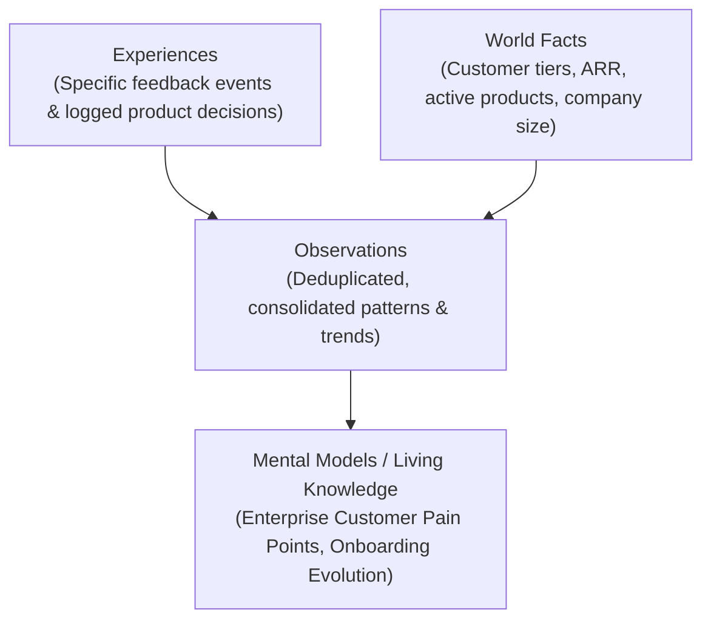

# Hindsight Integration & Memory Architecture

## 1. Overview
**Hindsight** (by Vectorize.io) is a biomimetic long-term memory engine for AI agents. Rather than treating customer feedback as ephemeral chat messages or static embedding chunks, Feedback Memory OS leverages Hindsight to turn feedback into persistent, structured organizational memory.

Official Documentation: [https://hindsight.vectorize.io/](https://hindsight.vectorize.io/)  
GitHub: [https://github.com/vectorize-io/hindsight](https://github.com/vectorize-io/hindsight)  
Hindsight Cloud: [https://ui.hindsight.vectorize.io](https://ui.hindsight.vectorize.io/)

---

## 2. Core Hindsight Operations

### A. `hindsight.retain()`
Used for every incoming customer feedback event and product decision.
```python
hindsight.retain(
    bank_id="workspace_nova_analytics",
    content='Customer Acme Corp (Enterprise) reported via Support: "API configuration during onboarding takes 3 days."',
    timestamp=datetime.datetime(2026, 2, 10, 12, 0, 0),
    context="customer_feedback",
    document_id="F1042",
    metadata={
        "customer": "Acme Corp",
        "segment": "Enterprise",
        "source": "Support",
        "product": "Nova API",
        "sentiment": "negative",
        "theme": "onboarding"
    },
    entities=[
        {"name": "Acme Corp", "type": "customer"},
        {"name": "Nova API", "type": "product"}
    ],
    tags=[
        "source:support",
        "segment:enterprise",
        "theme:onboarding",
        "sentiment:negative",
        "type:feedback"
    ],
    memory_type="experience"
)
```

### B. `hindsight.recall()`
Multi-strategy retrieval combining:
1. **Semantic Vector Search**: matches conceptual relevance.
2. **BM25 Keyword Matching**: matches exact technical terms (e.g. `mTLS`, `HMAC`, `VPC peering`).
3. **Entity Graph Traversal**: links customer accounts to affected product components.
4. **Temporal Reranking**: anchors evidence in historical sequence.

### C. `hindsight.reflect()`
Multi-hop historical reasoning across stored experiences, world facts, and observations.
Reflect synthesizes *why* opinions changed over time and evaluates whether product interventions achieved their intended outcomes.

---

## 3. Logical Memory Hierarchy



---

## 4. Multi-Tenant Hard Isolation
- Each tenant or organization operates within its own dedicated Hindsight memory bank: `workspace_{tenant_id}`.
- Cross-bank data leakage is mathematically blocked at the storage layer.
- Soft dimensional tags (`segment:enterprise`, `source:support`, `theme:onboarding`) enable faceted queries inside the bank.
